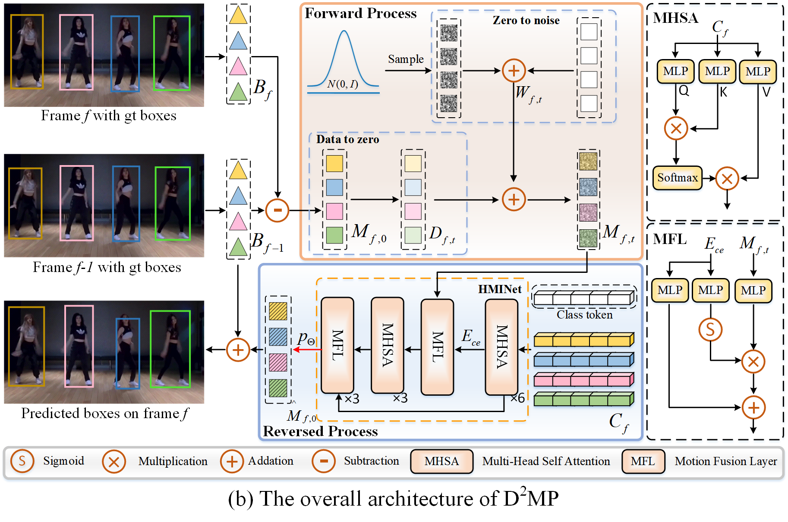

# DiffMOT
## DiffMOT: A Real-time Diffusion-based Multiple Object Tracker with Non-linear Prediction 


## Framework



## Tracking performance
### Benchmark Evaluation
| Dataset    |  HOTA | IDF1 | Assa | MOTA | DetA |
|--------------|-----------|--------|-------|----------|----------|
|DanceTrack  | 63.4 | 64.0 | 48.8 | 92.7 | 82.5 |
|SportsMOT   | 76.2 | 76.1 | 65.1 | 97.1 | 89.3 |
|MOT17       | 64.5 | 79.3 | 64.6 | 79.8 | 64.7 |
|MOT20       | 61.7 | 74.9 | 60.5 | 76.7 | 63.2 |

### Results on DanceTrack test set with different detector
| Detector    |  HOTA | IDF1 | MOTA | FPS |
|--------------|-----------|--------|-------|----------|
|YOLOX-S  | 53.3 | 56.6 | 88.4 | 30.3 |
|YOLOX-M  | 57.2 | 58.6 | 91.2 | 25.4 |
|YOLOX-L  | 61.5 | 61.7 | 92.0 | 24.2 |
|YOLOX-X  | 63.4 | 64.0 | 92.7 | 22.7 |

The tracking speed is test on an RTX 3090 GPU. Smaller detectors can achieve higher FPS, which indicates that DiffMOT can flexibly choose different detectors for various real-world application scenarios. With YOLOX-S, the tracking speed of the entire system can reach up to **30.3 FPS**.

## I. Installation.
* install torch
~~~
conda create -n diffmot python=3.9
conda activate diffmot
pip install torch==2.0.1 torchvision==0.15.2 torchaudio==2.0.2
~~~
* install other packages.
~~~
pip install -r requirement.txt
~~~
* install external dependencies.
~~~
cd external/YOLOX/
pip install -r requirements.txt && python setup.py develop
cd ../external/deep-person-reid/
pip install -r requirements.txt && python setup.py develop
cd ../external/fast_reid/
pip install -r docs/requirements.txt
~~~

## II. Prepare Data.
The file structure should look like:  
(a) DanceTrack:
~~~
{DanceTrack ROOT}
|-- dancetrack
|   |-- train
|   |   |-- dancetrack0001
|   |   |   |-- img1
|   |   |   |   |-- 00000001.jpg
|   |   |   |   |-- ...
|   |   |   |-- gt
|   |   |   |   |-- gt.txt            
|   |   |   |-- seqinfo.ini
|   |   |-- ...
|   |-- val
|   |   |-- ...
|   |-- test
|   |   |-- ...
~~~
(b) SportsMOT:
~~~
{SportsMOT ROOT}
|-- sportsmot
|   |-- splits_txt
|   |-- scripts
|   |-- dataset
|   |   |-- train
|   |   |   |-- v_1LwtoLPw2TU_c006
|   |   |   |   |-- img1
|   |   |   |   |   |-- 000001.jpg
|   |   |   |   |   |-- ...
|   |   |   |   |-- gt
|   |   |   |   |   |-- gt.txt
|   |   |   |   |-- seqinfo.ini         
|   |   |   |-- ...
|   |   |-- val
|   |   |   |-- ...
|   |   |-- test
|   |   |   |-- ...
~~~
(c) MOT17/20:
~~~
{MOT17/20 ROOT}
|-- mot
|   |-- train
|   |   |-- MOT17-02
|   |   |   |-- img1
|   |   |   |   |-- 000001.jpg
|   |   |   |   |-- ...
|   |   |   |-- gt
|   |   |   |   |-- gt.txt            
|   |   |   |-- seqinfo.ini
|   |   |-- ...
|   |   |-- MOT20-01
|   |   |   |-- img1
|   |   |   |   |-- 000001.jpg
|   |   |   |   |-- ...
|   |   |   |-- gt
|   |   |   |   |-- gt.txt            
|   |   |   |-- seqinfo.ini
|   |   |-- ...
|   |-- test
|   |   |-- ...
~~~

and run:

```
python dancetrack_data_process.py
python sports_data_process.py
python mot_data_process.py
```

## III. Training.
* Change the data_dir in config
* Train on DanceTrack, SportsMOT, and MOT17/20:
```
python main.py --config ./configs/dancetrack.yaml
python main.py --config ./configs/sportsmot.yaml
python main.py --config ./configs/mot.yaml
```

## IV. Tracking.
* Change the det_dir, info_dir, reid_dir, and save_dir in config
* Track on DanceTrack, SportsMOT, MOT17, and MOT20:
```
python main.py --config ./configs/dancetrack_test.yaml
python main.py --config ./configs/sportsmot_test.yaml
python main.py --config ./configs/mot17_test.yaml
python main.py --config ./configs/mot20_test.yaml
```

## Concat
If you have some questions, please concat with kroery@shu.edu.cn.

## Acknowledgement
A large part of the code is borrowed from [DDM-Public](https://github.com/GuHuangAI/DDM-Public) and [Deep-OC-SORT](https://github.com/GerardMaggiolino/Deep-OC-SORT). Thanks for their wonderful works.

## Citation
~~~
waiting for updating
~~~


